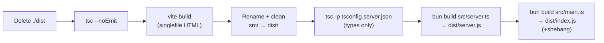

# Excalidraw MCP Server - Structure & Exploration Report

**Date:** 2024-12-15  
**Project Path:** `/home/anudeep/Documents/AI_content/AntiGravity/skills/excalidraw-mcp-server`  
**Working Directory:** `/home/anudeep/Documents/AI_content/AntiGravity/excalidraw-mcp-build`

---

## 1. Project Overview

### Metadata
- **Name:** `@mcp-demos/excalidraw-server`
- **Version:** `0.3.2`
- **Type:** MCP (Model Context Protocol) App Server
- **Language:** TypeScript + React
- **Runtime:** Node.js (≥18.0.0)
- **Package Manager:** pnpm (v10.11.0)

### Purpose
Streamable MCP server that renders hand-drawn Excalidraw diagrams as SVG with:
- Streaming animations (draw-on effects)
- Interactive fullscreen editing
- Checkpoint/restore functionality
- Screenshot context feedback to Claude
- Export to excalidraw.com

### Key Statistics
- **Total Lines of Code:** ~2,484 (TS/TSX files only)
- **Directory Size:** ~38MB (includes pnpm-lock, .git history)
- **Dependencies:** 24 direct + optional Bun binaries
- **Source Files:** 11 TypeScript files (src/ + api/)

---

## 2. Directory Structure

```
excalidraw-mcp-server/
├── .git/                          # Git repository with full history
├── .gitignore                     # Standard Node.js ignores
├── .mcpbignore                    # MCP build exclusions (see below)
├── .npmrc                         # npm/pnpm config: node-linker=hoisted
├── .vscode/                       # IDE configuration
│
├── api/
│   └── mcp.ts                     # Vercel HTTP handler (imports ../src)
│
├── src/
│   ├── main.ts                    # MCP server entry (HTTP + stdio)
│   ├── server.ts                  # Tool registration & MCP logic
│   ├── checkpoint-store.ts        # State persistence layer
│   ├── edit-context.ts            # Internal edit tracking
│   ├── sounds.ts                  # Audio utilities
│   ├── pencil-audio.ts            # Audio data
│   ├── mcp-app.tsx                # React widget (Excalidraw core)
│   ├── mcp-entry.tsx              # Production React entry
│   ├── dev.tsx                    # Development mock UI
│   ├── dev-mock.ts                # Mock MCP for standalone dev
│   └── vite-env.d.ts              # Vite type definitions
│
├── docs/
│   ├── logo.png                   # Manifest icon
│   └── demo.gif                   # README demo
│
├── scripts/
│   ├── build.mjs                  # Build orchestration
│   └── setup-bun.mjs              # Optional Bun setup
│
├── package.json                   # Dependencies & scripts
├── pnpm-lock.yaml                 # Locked dependency tree
├── tsconfig.json                  # TypeScript config (src + server.ts)
├── tsconfig.server.json           # TypeScript config (server compilation)
├── vite.config.ts                 # Build config (Vite + singlefile plugin)
├── vite.config.dev.ts             # Dev server config
├── vercel.json                    # Vercel deployment config
├── manifest.json                  # MCP manifest (0.3 spec)
├── CLAUDE.md                      # Comprehensive architecture guide
└── README.md                      # Installation & usage guide
```

---

## 3. Build System & Scripts

### Package.json Scripts

| Script | Command | Purpose |
|--------|---------|---------|
| `postinstall` | `node scripts/setup-bun.mjs` | Optional: Install Bun runtime |
| `build` | `node scripts/build.mjs` | **PRIMARY** — Full build pipeline |
| `watch` | `vite build --watch` | Continuous rebuild during dev |
| `serve` | `bun --watch src/main.ts` | MCP server with hot-reload |
| `start` | `NODE_ENV=development npm run build && npm run serve` | Dev mode (build + serve) |
| `dev` | `concurrently 'npm run watch' 'npm run serve'` | Full dev mode (watch + serve parallel) |
| `dev:ui` | `vite --config vite.config.dev.ts` | Vite dev server only (no MCP) |
| `prepublishOnly` | `npm run build` | Auto-build before npm publish |

### Build Pipeline (scripts/build.mjs)



**Key Points:**
- Uses **Bun** (not Node) for final bundling (`bun build`)
- **Vite** creates single-file HTML (via `vite-plugin-singlefile`)
- **TypeScript** only for type-checking, not emitting code
- Output: `dist/index.js` (CLI entry), `dist/server.js` (library entry), `dist/mcp-app.html` (widget)

---

## 4. Vite Configuration

### Production Build (vite.config.ts)

```typescript
// External modules — loaded from esm.sh CDN at runtime
external: [
  "react",
  "react-dom",
  "react-dom/client",
  "react/jsx-runtime",
  "@excalidraw/excalidraw",
  "morphdom"
]

// Path mapping — CDN URLs for runtime imports
paths: {
  "react": "https://esm.sh/react@19.0.0",
  "react-dom": "https://esm.sh/react-dom@19.0.0?deps=react@19.0.0",
  "@excalidraw/excalidraw": "https://esm.sh/@excalidraw/excalidraw@0.18.0?deps=react@19.0.0,react-dom@19.0.0",
  "morphdom": "https://esm.sh/morphdom@2.7.8"
}

// Output: Single HTML file with inlined CSS/JS
input: "src/mcp-app.html"
outDir: "dist"
```

**CSP Implications:**
- Excalidraw loads **Virgil font from esm.sh** → CSP includes `https://esm.sh`
- Widget resource has `prefersBorder: true` + font CSP in `_meta.ui`

### Development Build (vite.config.dev.ts)

- Resolves modules from `node_modules/` (not CDN)
- Enables sourcemaps (`inline` in dev, none in prod)
- Dev server runs on `http://localhost:5173/index-dev.html`

---

## 5. TypeScript Configuration

### Main Config (tsconfig.json)
```json
{
  "compilerOptions": {
    "target": "ESNext",
    "lib": ["ESNext", "DOM", "DOM.Iterable"],
    "module": "ESNext",
    "moduleResolution": "bundler",
    "jsx": "react-jsx",
    "strict": true,
    "noUnusedLocals": true,
    "noUnusedParameters": true
  },
  "include": ["src", "server.ts"]
}
```

### Server Config (tsconfig.server.json)
- Compiles only `src/server.ts`, `src/checkpoint-store.ts`, etc.
- Target: `ESNext` for Node.js
- Used **only** for type emission (`tsc -p tsconfig.server.json`)

---

## 6. Dependencies & Imports

### Critical External References

#### From `api/mcp.ts` → Vercel Handler
```typescript
import { createVercelStore } from "../src/checkpoint-store.js";  // ← RELATIVE
import { registerTools } from "../src/server.js";              // ← RELATIVE
```

**Migration Implication:** Vercel deployment expects `api/` → `../src/` structure. If moving to monorepo, paths must be updated.

#### From `src/main.ts` → CLI Entry
```typescript
import { FileCheckpointStore } from "./checkpoint-store.js";
import { createServer } from "./server.js";  // ← Local imports (safe)
```

### Key Dependencies

| Package | Version | Purpose |
|---------|---------|---------|
| `@excalidraw/excalidraw` | ^0.18.0 | Diagram rendering library |
| `@modelcontextprotocol/sdk` | 1.25.2 | MCP protocol implementation |
| `@modelcontextprotocol/ext-apps` | ^0.4.0 | MCP Apps extension (widgets) |
| `express` | ^5.1.0 | HTTP server framework |
| `morphdom` | ^2.7.8 | DOM diffing for SVG updates |
| `react` | ^19.0.0 | UI framework |
| `@upstash/redis` | ^1.34.0 | Optional: Persistent KV (Vercel) |
| `zod` | ^4.0.0 | Schema validation |
| `mcp-handler` | 1.0.7 | MCP HTTP transport handler |

### Optional Dependencies (Bun Runtime)
- Platform-specific Bun binaries (darwin, linux, windows × arch variants)
- Used only if `bun` command not already installed globally

---

## 7. Git Status & Version Control

### Current State
- **Branch:** `main` (tracking `origin/main`)
- **Status:** ✅ Clean (no uncommitted changes)
- **Recent Commits:**
  ```
  157aa23 fix: mobile fullscreen layout — safe area insets + export button (#55)
  542091b fix(mcp): root route alias for /mcp not working (#40)
  2d05fc1 feat(app): tweak UI main menu and buttons (#39)
  ...
  a8beae3 chore: use pnpm
  ```

### Important Git Configuration
- `.gitignore` includes: `node_modules/`, `dist/`, `*.mcpb`, `.vercel`, `bun.lock`, `opencode.json`
- `.mcpbignore` (MCP build exclusions):
  - Excludes: `node_modules/`, `src/`, `*.ts`, `tsconfig.*`, `vite.config.ts`, `CLAUDE.md`, `.git/`
  - Includes: `dist/`, `manifest.json`, `package.json`, `pnpm-lock.yaml`, `docs/`

---

## 8. Configuration Files Analysis

### manifest.json (MCP Manifest v0.3)

```json
{
  "manifest_version": "0.3",
  "name": "excalidraw-mcp-app",
  "version": "0.3.2",
  "server": {
    "type": "node",
    "entry_point": "dist/index.js",
    "mcp_config": {
      "command": "node",
      "args": ["${__dirname}/dist/index.js", "--stdio"]
    }
  },
  "tools": [
    { "name": "read_me", "description": "... cheat sheet" },
    { "name": "create_view", "description": "... rendering" }
  ]
}
```

**Key Points:**
- **Entry point:** `dist/index.js` (built by Bun)
- **Transport:** stdio (Claude Desktop) or HTTP (Vercel)
- **Tools:** 2 MCP tools + 1 resource (UI widget)

### vercel.json (Deployment Config)

```json
{
  "buildCommand": "pnpm run build",
  "outputDirectory": ".",
  "rewrites": [
    { "source": "/mcp", "destination": "/api/mcp" },
    { "source": "/sse", "destination": "/api/mcp" },
    { "source": "/message", "destination": "/api/mcp" }
  ]
}
```

**Key Points:**
- Routes `/mcp`, `/sse`, `/message` → `api/mcp.ts` (HTTP handler)
- Requires `pnpm run build` to complete before runtime
- Output dir is `.` (project root)

---

## 9. Key Design Patterns

### Architecture Layers

1. **Server Layer** (`src/server.ts`)
   - Tool registration
   - Element validation (Zod schemas)
   - SVG rendering orchestration

2. **State Layer** (`src/checkpoint-store.ts`)
   - `CheckpointStore` interface (3 implementations)
   - File-based (dev), Memory (Vercel default), Redis (Upstash)

3. **Transport Layer** (`src/main.ts`)
   - HTTP (Streamable) — stateless per-request
   - stdio — Claude Desktop connection
   - Express middleware for CORS + request handling

4. **Widget Layer** (`src/mcp-app.tsx`)
   - React component wrapping Excalidraw SVG rendering
   - morphdom diffing for smooth streaming updates
   - Fullscreen mode with safe-area insets

### Checkpoint System

- **Server-side:** Persists diagram elements + camera state
- **Client-side:** localStorage cache for fast retrieval
- **Persistence:** Redis (Upstash) on Vercel, file system in dev
- **Key:** 18-char truncated UUIDs (collision-resistant, URL-safe)

---

## 10. External Path References

### Summary of Relative Imports

| File | Imports | Direction | Blocker |
|------|---------|-----------|---------|
| `api/mcp.ts` | `../src/checkpoint-store.js` | Parent → src | ⚠️ **YES** |
| `api/mcp.ts` | `../src/server.js` | Parent → src | ⚠️ **YES** |
| `src/main.ts` | `./checkpoint-store.js` | Sibling → src | ✅ No |
| `src/server.ts` | `./checkpoint-store.js` | Sibling → src | ✅ No |

**Critical Finding:** The `api/` directory has hard-coded `../src/` imports. This assumes a specific directory structure that may need adjustment if migrating to a monorepo layout.

---

## 11. Potential Migration Blockers

### 1. **Vercel Deployment Dependency**
- `api/mcp.ts` is designed for Vercel's serverless functions
- HTTP handler wraps MCP logic for stateless execution
- **Blocker Level:** 🟡 Medium — requires reconfiguration for non-Vercel hosting

### 2. **Bun Build Requirement**
- Final bundling uses `bun build` (not webpack/esbuild/tsc)
- Bun must be installed globally or via optional dependencies
- **Blocker Level:** 🟡 Medium — consider fallback to esbuild if Bun unavailable

### 3. **ESM.sh CDN Hard-Coded**
- Vite config hardcodes `https://esm.sh/` for React + Excalidraw
- CSP must allow `esm.sh` domain in widget resource
- **Blocker Level:** 🟢 Low — acceptable for production, consider caching strategy for offline

### 4. **pnpm Requirement**
- `packageManager: "pnpm@10.11.0"` enforces pnpm
- npm/yarn may fail due to hoisting differences
- **Blocker Level:** 🟢 Low — pnpm is widely available

### 5. **Checkpoint Store Flexibility**
- Multiple implementations (File/Memory/Redis) available
- Requires explicit factory selection based on environment
- **Blocker Level:** 🟢 Low — well-documented, production-ready

---

## 12. Build Artifacts

### Output Directory Structure (after `npm run build`)

```
dist/
├── index.js                 # CLI entry (with #!/usr/bin/env node shebang)
├── server.js                # Library export (@mcp-demos/excalidraw-server)
├── server.d.ts              # TypeScript types
├── mcp-app.html             # Single-file widget (inlined CSS/JS)
└── [source maps]            # Inline sourcemaps (dev only)
```

### Build Output Characteristics

- **Size:** ~200-300KB (minified) for HTML widget
- **Dependencies:** All externals (react, morphdom) loaded from CDN
- **Portability:** Self-contained, no runtime build step needed
- **Format:** ESM modules (Node.js 18+)

---

## 13. Development Workflow

### Local Development
```bash
# Full dev mode (watch + serve)
npm run dev

# Vite UI only (no MCP)
npm run dev:ui

# Manual steps
npm run build          # Build artifacts
npm run watch         # Continuous rebuild
npm run serve         # Start MCP server
```

### Logging & Debugging
- **Widget logs:** Via SDK logger (`app.sendLog()`) → `~/Library/Logs/Claude/claude.ai-web.log`
- **Server logs:** stdout from `npm run serve`
- **Never use:** `console.log()` in widget code

### Testing
- No test framework configured (Jest/Vitest)
- Manual testing via Claude Desktop or HTTP client
- Dev mock available (`src/dev-mock.ts` + `npm run dev:ui`)

---

## 14. Key Constraints & Gotchas

### Runtime Constraints
- Node.js ≥18.0.0 required (ESM modules)
- Bun optional but recommended for builds
- pnpm 10.11.0 specified (npm/yarn may have issues)

### Code Constraints
- **No `.d.ts` generation** for React components (only `server.d.ts`)
- **No hot-reload for tool definitions** (must restart server)
- **No HTTP/S certs management** (relies on host)

### Widget Constraints
- **Cannot use console.log** in React components (use SDK logger)
- **Must not transform SVG elements** (breaks morphdom diffing)
- **Font loading via esm.sh** (CSP-dependent, online-only)
- **Mobile fullscreen** requires safe-area insets (iOS/Android)

---

## 15. Key Files for Migration

### Most Important Files to Review

| File | Lines | Purpose | Criticality |
|------|-------|---------|------------|
| `CLAUDE.md` | 205 | Architecture decisions + debugging | ⭐⭐⭐ |
| `src/server.ts` | ~300 | Tool registration & logic | ⭐⭐⭐ |
| `api/mcp.ts` | 27 | Vercel handler (path-sensitive) | ⭐⭐ |
| `scripts/build.mjs` | 41 | Build orchestration | ⭐⭐ |
| `vite.config.ts` | 39 | Output structure & CDN config | ⭐⭐ |
| `src/checkpoint-store.ts` | ~200 | State persistence layer | ⭐⭐ |
| `src/mcp-app.tsx` | ~300 | Widget rendering | ⭐ |
| `manifest.json` | 44 | MCP metadata | ⭐ |

---

## 16. Environment Variables & Secrets

### Required Environment Variables
- None for local development
- **For Vercel + Redis:**
  - `UPSTASH_REDIS_REST_URL`
  - `UPSTASH_REDIS_REST_TOKEN`

### Sensitive Configuration
- No API keys in code (only env vars)
- Redis credentials stored in Vercel secrets (not committed)
- Safe for public repositories

---

## Summary Table

| Dimension | Finding |
|-----------|---------|
| **Structure** | Well-organized monolithic MCP server; Vercel API layer separate but path-dependent |
| **Build** | Multi-stage pipeline (tsc → vite → bun); deterministic and reproducible |
| **Dependencies** | 24 direct deps + optional Bun; minimal external coupling |
| **Git** | Clean repo, no uncommitted changes; full history preserved |
| **Migration Ready** | 🟢 YES — well-documented, self-contained; requires path updates for monorepo |
| **Deployment** | 🟢 Ready for Vercel, local Node, or Docker; configurable storage backends |
| **Blockers** | 🟡 Bun build requirement; 🟡 Vercel API structure; 🟡 pnpm enforcement |
| **Maintainability** | 🟢 Good; CLAUDE.md is comprehensive; clear separation of concerns |

---

## Recommendations for Migration

1. **Plan directory layout** — Decide monorepo structure before moving `api/` 
2. **Lock build tool** — Consider fallback if Bun unavailable (esbuild alternative)
3. **Test Vercel paths** — Update `api/mcp.ts` imports before deploying
4. **Document environment** — Add `.env.example` with Redis variables
5. **Version lock** — Keep pnpm exact version (10.11.0)
6. **Export types** — Consider generating `.d.ts` for React components if library usage needed

---

**Generated:** 2024-12-15 | **Status:** Ready for migration planning
